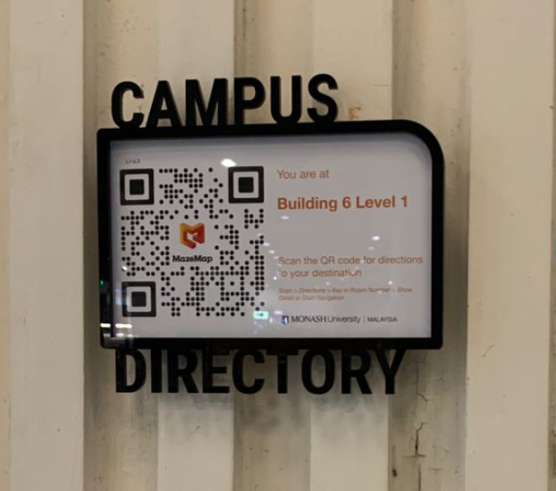
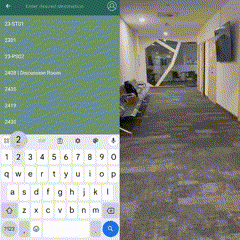
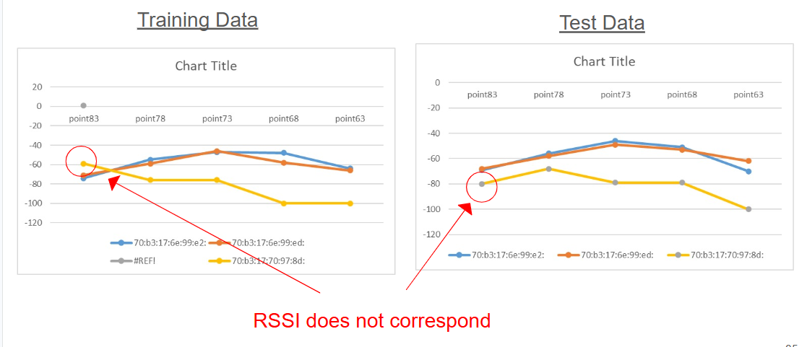
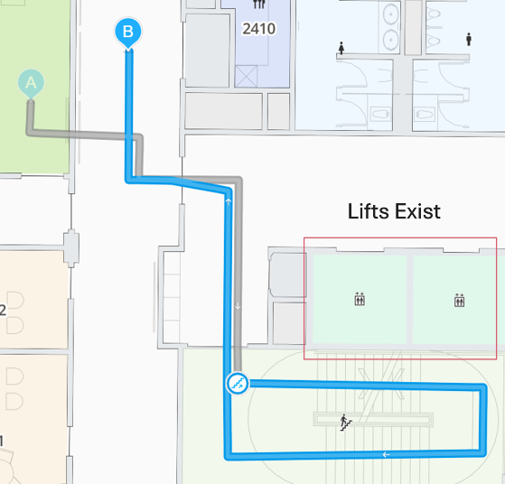
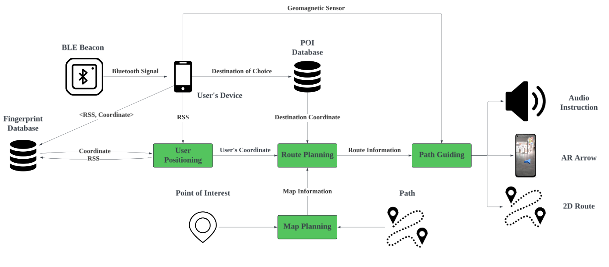
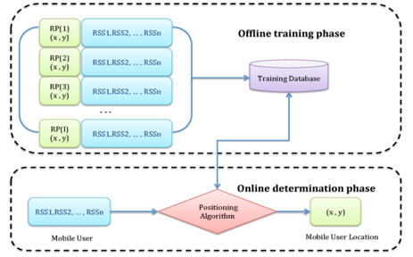
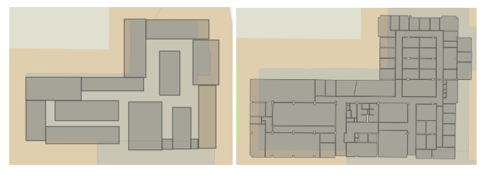
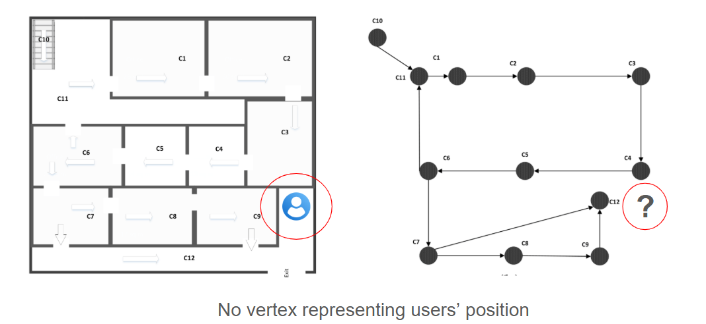
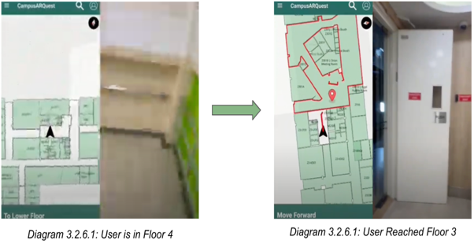
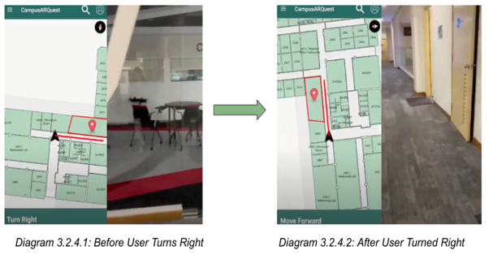

# Monash Indoor Navigation System

## Background

Navigating large, multi-level buildings can be incredibly frustrating. Unlike the outdoors, where users can rely on street layouts and distant landmarks to find their bearings, indoor spaces trap users behind walls, identical-looking corridors, and counter-intuitive vertical floors. This lack of clear orientation and dynamic routing options leads to navigation anxiety and confusion.

## Problem Statement

Current campus navigation relies on static physical markers or discrete QR scan points, offering no active guidance.

**Monash's Existing Solution: Fixed QR Code Scane Plates**

While scanning a QR code provides a single, point-in-time coordinate, it fails the moment the user starts walking. What happens when the user cannot recall the path and makes a wrong turn? 

Our solution is designed to make navigating complex indoor environments highly precise, providing continuous, real-time navigation and positioning directly to the user's screen without requiring them to search for physical markers, scan codes, or perform any extra manual tasks.

## Demonstration    

## Problem Analysis

### 1. Automated Positioning

To deliver a hands-free navigation experience, the system must automatically and continuously resolve the user's location coordinates. Traditional Wi-Fi fingerprinting was analyzed as an option but failed due to physical and infrastructure constraints:

1. **Signal Volatility:** Wi-Fi RSSI signals fluctuate heavily due to user density, weather, and physical obstacles.
2. **Lack of Infrastructure Control:** Access points are managed by university IT, preventing adjustments to signal strength behavior for more accurate positioning.

The graph below illustrates the high discrepancy between theoretical training signal strengths and actual testing-phase RSSI deviations:

### 2. Dynamic Routing

Static routing systems rely on pre-configured paths that are designed based on human judgement. These manually defined routes do not guarantee the most optimal path—they simply reflect what a developer or administrator believed was a reasonable direction at the time of configuration. As a result, users are often guided along sub-optimal routes that involve unnecessary detours or longer walking distances.

Furthermore, static routes are inherently fragile. When a path becomes unavailable—due to corridor closures, elevator maintenance, or safety blockages—the entire route breaks. The system cannot reroute the user on the fly; instead, the route must be manually reconfigured by a developer before navigation can resume, leaving users stranded in the meantime.

Most critically, static routing does not scale. As positioning technology becomes more precise and the system can resolve a user's location to finer coordinates, the number of possible starting points grows exponentially. Manually authoring a route from every possible user position to every possible destination is simply not feasible.

### 3. Contextual Awareness

Even with a precise coordinate and a route drawn on a map, users still struggle to relate where they physically are to what is shown on screen. A dot on a 2D floor plan means very little when the user is standing in an identical-looking corridor with no distinguishing features—they cannot tell which direction they are facing, whether the route requires them to walk forward or turn around, or which of two opposing hallways leads to their destination.

This disconnect between the map and the user's real-world orientation makes traditional map overlays deeply unintuitive. Without knowing the user's heading, the system has no way to translate a route into actionable, human-readable instructions like "Turn Left" or "Move Forward." The user is left mentally rotating the map, second-guessing their direction, and frequently walking the wrong way before correcting course.

## Proposed Solution

### 1. Automated Positioning: BLE Fingerprinting with KNN

Wi-Fi fingerprinting is a known technique for indoor positioning, but university IT controls the access points — we could not adjust their placement or signal behavior to get reliable results. Our solution adapts the same fingerprinting approach using Bluetooth Low Energy (BLE) beacons that we deploy and manage ourselves.

**Fingerprinting Technique (Zhao et al., 2018)**

Beacons placed around the building broadcast a signal. The app measures the strength of each signal and compares it against a pre-recorded fingerprint database using Euclidean distance. A K-Nearest Neighbors (KNN) algorithm identifies the closest matching points in the database and averages their coordinates to estimate the user's position. If beacon signals are too weak, the system falls back to the nearest beacon as a location estimate. The user gets continuous positioning without scanning QR codes or any manual steps.

### 2. Dynamic Routing: Map Planning and Route Planning

#### 2.1 Map Planning

Before any routing can happen, the system needs a digital representation of the building layout. Manually drawing and labelling each object on the floor plan was too time-consuming, so we automated the process by scraping GeoJSON map data from Monash's existing solution.

**Comparing manually generated data vs scraped data**

#### 2.2 Route Planning

The pathfinding graph only contains fixed points of interest, but the user can be anywhere. Pre-populating the graph with every possible position would make it impractically large. We solved this with a dynamic source node integration.

The user's coordinates are inserted as a new vertex and connected to the nearest points of interest in the graph before Dijkstra's runs. This keeps the graph compact while allowing routing from any starting point.

**How about multi-floor navigations?**

When user trasitions across each floor, the map automatically updates to the corresponding floor layout that the user is in.

### 3. Contextual Awareness: Translating Routes into Actions

Knowing the route is not enough — the user needs to know what to do at each step. To determine this, the system computes the forward azimuth (the direction the user should walk) using Vincenty's Formula between the user's current position and the next coordinate along the route. This gives the required bearing to the next waypoint.

However, the forward azimuth alone is insufficient because the user can be facing any direction. The system also reads the device's geomagnetic sensor to determine the user's current orientation. The difference between these two values tells the system what action the user needs to take — Forward, Turn Left, Turn Right, or Turn Back. The command is displayed on the screen and announced via voice, turning a computed path into clear, actionable instructions.

